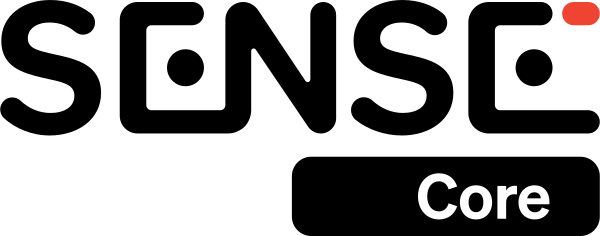

<div align="center">



**State-of-the-art Real-time Action Recognition**

---

<!-- TABLE OF CONTENTS -->
<p align="center">
  <a href="https://www.20bn.com/">Website</a> •
  <a href="https://medium.com/twentybn/towards-situated-visual-ai-via-end-to-end-learning-on-video-clips-2832bd9d519f">Blogpost</a> •  
  <a href="#getting-started">Getting Started</a> •
  <a href="#build-your-own-classifier">Build Your Own Classifier</a> •
  <a href="#ios-deployment">iOS Deployment</a> •
  <a href="https://20bn.com/products/datasets">Datasets</a> •   
  <a href="https://20bn.com/licensing/sdk/evaluation">SDK License</a>
</p>

<!-- BADGES -->
<p align="center">
    <a href="https://20bn.com/">
        
    </a>
    <a href="https://github.com/TwentyBN/sense/master/LICENSE">
        
    </a>
    <a href="https://github.com/TwentyBN/sense/releases">
        
    </a>
    <a href="https://github.com/TwentyBN/sense/blob/master/CODE_OF_CONDUCT.md">
        
    </a>
</p>

</div>

---

<!-- Add some bullet points for what this repo provides-->
`sense`is an inference engine to serve powerful neural networks for action recognition, with a low
 computational footprint. In this repository, we provide: 
 - Two models out-of-the-box pre-trained on millions of videos of humans performing 
 actions in front of, and interacting with, a camera. Both neural networks are small, efficient, and run smoothly in real time on a CPU.
- Demo applications showcasing the potential of our models: gesture recognition, fitness activity tracking, live
 calorie estimation.
- A pipeline to record and annotate your own video dataset and train a custom classifier on top of our models with an easy-to-use script to fine-tune our weights.

<div align="center">

###### Gesture Recognition

<p align="center">
    
    
</p>

*(full video can be found [here](https://drive.google.com/file/d/1G5OaCsPco_4H7F5-s6n2Mm3wI5V9K6WE/view?usp=sharing))*


###### Fitness Activity Tracker and Calorie Estimation

<p align="center">
    
    
</p>

*(full video can be found [here](https://drive.google.com/file/d/1f1y0wg7Y1kpSBwKSEFx1TDoD5lGA8DtQ/view?usp=sharing))*

</div>

<!-- 
## From the Community 
-->
<!-- Projects from the community -->

---

## Requirements and Installation
The following steps are confirmed to work on Linux (Ubuntu 18.04 LTS and 20.04 LTS) and macOS (Catalina 10.15.7).

#### Step 1: Clone the repository
To begin, clone this repository to a local directory of your choice:
```
git clone https://github.com/TwentyBN/sense.git
cd sense
```

#### Step 2: Install Dependencies
We recommended creating a new virtual environment to install our dependencies using 
[conda](https://docs.conda.io/en/latest/miniconda.html) or [`virtualenv`](https://docs.python.org/3/library/venv.html
). The following instructions will help create a conda environment. 

```shell
conda create -y -n sense python=3.6
conda activate sense
```

Install Python dependencies:

```shell
pip install -r requirements.txt
```

Note: `pip install -r requirements.txt` only installs the CPU-only version of PyTorch.
To run inference on your GPU,  another version of PyTorch should be installed (e.g. 
`conda install pytorch torchvision cudatoolkit=10.2 -c pytorch`). 
See all available install commands [here](https://pytorch.org/).

#### Step 3: Download the SenseKit Weights
Pre-trained weights can be downloaded from [here](https://20bn.com/licensing/sdk/evaluation), subject to separate terms. 
Follow the instructions to create an account, agree to evaluation license and download the weights. Once downloaded, unzip the folder and move the 
folder named `backbone` into `sense/resources`. In the end, your resources folder structure should look like
 this:

```
resources
├── backbone
│   ├── strided_inflated_efficientnet.ckpt
│   └── strided_inflated_mobilenet.ckpt
├── fitness_activity_recognition
│   └── ...
├── gesture_recognition
│   └── ...
└── ...
```

Note: The remaining folders in `resources/` will already have the necessary files -- only `resources/backbone` 
needs to be downloaded separately. 

--- 

## Getting Started
To get started, try out the demos we've provided. Inside the `sense/examples` directory, you will find 3 Python scripts,
`run_gesture_recognition.py`, `run_fitness_tracker.py`, and `run_calorie_estimation.py`. Launching each demo is as
 simple as running the script in terminal as described below. 

#### Demo 1: Gesture Recognition

`examples/run_gesture_recognition.py` applies our pre-trained models to hand gesture recognition.
30 gestures are supported (see full list 
[here](https://github.com/TwentyBN/sense/blob/master/sense/downstream_tasks/gesture_recognition/__init__.py)).

Usage:
```shell
PYTHONPATH=./ python examples/run_gesture_recognition.py
```


#### Demo 2: Fitness Activity Tracking

`examples/run_fitness_tracker.py` applies our pre-trained models to real-time fitness activity recognition and calorie estimation. 
In total, 80 different fitness exercises are recognized (see full list 
[here](https://github.com/TwentyBN/sense/blob/master/sense/downstream_tasks/fitness_activity_recognition/__init__.py)).

Usage:

```shell
PYTHONPATH=./ python examples/run_fitness_tracker.py --weight=65 --age=30 --height=170 --gender=female
```

Weight, age, height should be respectively given in kilograms, years and centimeters. If not provided, default values will be used.

Some additional arguments can be used to change the streaming source:
```
  --camera_id=CAMERA_ID           ID of the camera to stream from
  --path_in=FILENAME              Video file to stream from. This assumes that the video was encoded at 16 fps.
```

It is also possible to save the display window to a video file using:
```
  --path_out=FILENAME             Video file to stream to
```

For the best performance, the following is recommended: 
- Place your camera on the floor, angled upwards with a small portion of the floor visible
- Ensure your body is fully visible (head-to-toe) 
- Try to be in a simple environment (with a clean background) 


#### Demo 3: Calorie Estimation

In order to estimate burned calories, we trained a neural net to convert activity features to the corresponding [MET value](https://en.wikipedia.org/wiki/Metabolic_equivalent_of_task).
We then post-process these MET values (see correction and aggregation steps performed [here](https://github.com/TwentyBN/sense/blob/master/sense/downstream_tasks/calorie_estimation/calorie_accumulator.py)) 
and convert them to calories using the user's weight.

If you're only interested in the calorie estimation part, you might want to use `examples/run_calorie_estimation.py` which has a slightly more
detailed display (see video [here](https://drive.google.com/file/d/1VIAnFPm9JJAbxTMchTazUE3cRRgql6Z6/view?usp=sharing) which compares two videos produced by that script).

Usage:
```shell
PYTHONPATH=./ python examples/run_calorie_estimation.py --weight=65 --age=30 --height=170 --gender=female
```

The estimated calorie estimates are roughly in the range produced by wearable devices, though they have not been verified in terms of accuracy. 
From our experiments, our estimates correlate well with the workout intensity (intense workouts burn more calories) so, regardless of the absolute accuracy, it should be fair to use this metric to compare one workout to another.

---

## Build Your Own Classifier with SenseStudio

This section will describe how you can use our SenseStudio tool to build your own custom classifier on top of our models. 
Our models will serve as a powerful feature extractor that will reduce the amount of data you need to build your project. 

#### Step 1: Project Setup

First, run the `tools/sense_studio/sense_studio.py` script and open http://127.0.0.1:5000/ in your browser.
There you can set up a new project in a location of your choice and specify the classes that you want to collect.

The tool will prepare the following file structure for your project:

```
/path/to/your/dataset/
├── videos_train
│   ├── class1
│   ├── class2
│   └── ...
├── videos_valid
│   ├── class1
│   ├── class2
│   └── ...
└── project_config.json
```
- Two top-level folders: one for the training data, one for the validation data.
- One sub-folder for each class that you specify.

#### Step 2: Data Collection

You can record videos for each class right in your browser by pressing the "Record" button.
Make sure that you have [ffmpeg](https://ffmpeg.org/) installed for that.

Otherwise, you can also just move existing videos into the corresponding project folders.
Those should have a framerate of 16 fps or higher.

In the end you should have at least one video per class and train/valid split, but preferably more.
In some cases, as few as 2-5 videos per class have been enough to achieve excellent performance with our models!

#### Step 3: Training

Once your data is prepared, go to the training page in SenseStudio to train a custom classifier.
You can specify, which of our pretrained feature extractors should be used and how many of its layers should be
fine-tuned. Setting this parameter to 0 means that only your new classification head will be trained.

####  Step 4: Running your model

The training script will produce a checkpoint file called `best_classifier.checkpoint` in the 
`checkpoints/<your-output-folder-name>/` directory of your project.
You can now run it live using the following script:

```shell
PYTHONPATH=./ python tools/run_custom_classifier.py --custom_classifier=/path/to/your/checkpoint/ [--use_gpu]
```

### Advanced Options

You can further improve your model's performance by training on top of temporally annotated data; 
individually tagged frames that identify the event locally in the video versus treating every frame with the same 
label. For instructions on how to prepare your data with temporal annotations, refer to this 
[page](https://github.com/TwentyBN/sense/wiki/SenseStudio#temporal-annotations).

After preparing the temporal annotations for your dataset in SenseStudio, you can run the training with the
`Temporal Annotations` flag enabled to train on those frame-wise tags instead of the whole-video classes.

---

## iOS Deployment

If you're interested in mobile app development and want to run our models on iOS devices, please 
check out [sense-iOS](https://github.com/TwentyBN/sense-iOS) for step by step instructions on how 
to get our gesture demo to run on an iOS device. One of the steps involves converting our Pytorch 
models to the TensorFlow Lite format.

### Conversion to TensorFlow Lite

Our models can be converted to TensorFlow Lite using the following script:

```shell
python tools/conversion/convert_to_tflite.py --backbone_name=StridedInflatedEfficientNet --backbone_version=pro --classifier=gesture_recognition --output_name=model
```

If you want to convert a custom classifier, set the classifier name to "custom_classifier", 
and provide the path to the dataset directory used to train the classifier using the "--path_in" argument.
```shell
python tools/conversion/convert_to_tflite.py --classifier=custom_classifier --path_in=/path/to/your/checkpoint/ --output_name=model
```

---

<!--
## Contributing
-->
<!-- Describe how developers can contribute --> 

## Citation

We now have a [blogpost](https://medium.com/twentybn/towards-situated-visual-ai-via-end-to-end-learning-on-video-clips-2832bd9d519f) you can cite:

```bibtex
@misc{sense2020blogpost,
    author = {Guillaume Berger and Antoine Mercier and Florian Letsch and Cornelius Boehm and 
              Sunny Panchal and Nahua Kang and Mark Todorovich and Ingo Bax and Roland Memisevic},
    title = {Towards situated visual AI via end-to-end learning on video clips},
    howpublished = {\url{https://medium.com/twentybn/towards-situated-visual-ai-via-end-to-end-learning-on-video-clips-2832bd9d519f}},
    note = {online; accessed 23 October 2020},
    year=2020,
}
```

---

## License 

The code is copyright (c) 2020 Twenty Billion Neurons GmbH under an MIT Licence. See the file LICENSE for details. Note that this license 
only covers the source code of this repo. Pretrained weights come with a separate license available [here](https://20bn.com/licensing/sdk/evaluation).

The code makes use of these sounds from [freesound](https://freesound.org/):
- "[countdown_sound.wav](https://freesound.org/s/244437/)" from "[milton.](https://freesound.org/people/milton./)" licensed under CC0 1.0
- "[done_sound.wav](https://freesound.org/s/388046/)" and "[exit_sound.wav](https://freesound.org/s/388047/)" from "[paep3nguin](https://freesound.org/people/paep3nguin/)" licensed under CC0 1.0
